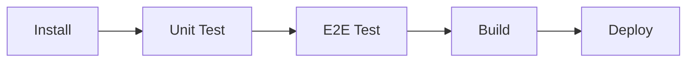

  <h3 align="center">Tasks</h3>
  

    To-do list management web app
     
    <a href="https://tasks.griffindow.com">Website</a>
    ·
    <a href="https://github.com/griffinodow/tasks/issues">Report Bug</a>
  

## About

My very first app. A todo list management web app based on React & Redux. Create lists, add tasks to lists, and mark them as complete.

## Built With

### Languages

- TypeScript

### Frameworks

- AWS CDK
- React
- Redux
- Jest
- Cypress
- MUI

### AWS

- Route 53
- S3

## CI Pipeline

Powered by GitHub Actions.

## Getting Started

| Description          | Command                |
| -------------------- | ---------------------- |
| Setup project        | `npm install`          |
| Develop with React   | `npm run start`        |
| Develop with tests   | `npm run test:watch`   |
| Develop with Cypress | `npm run cypress:open` |
| Run unit tests       | `npm run test:unit`    |
| Run E2E tests        | `npm run test:e2e`     |
